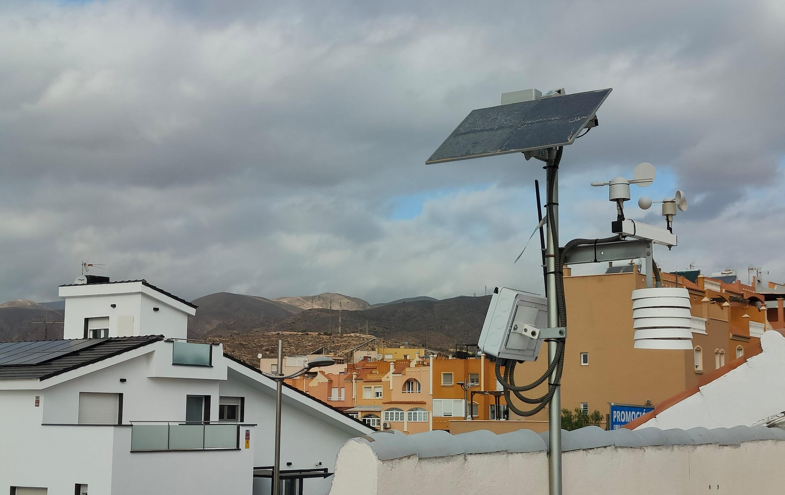
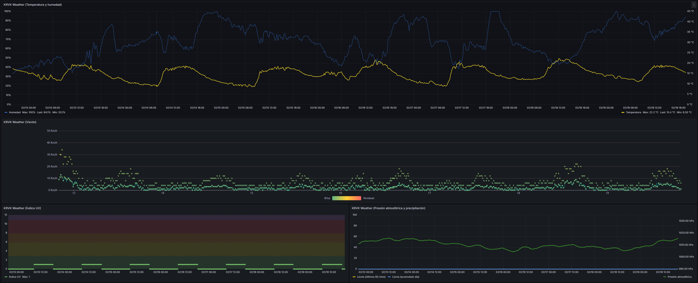
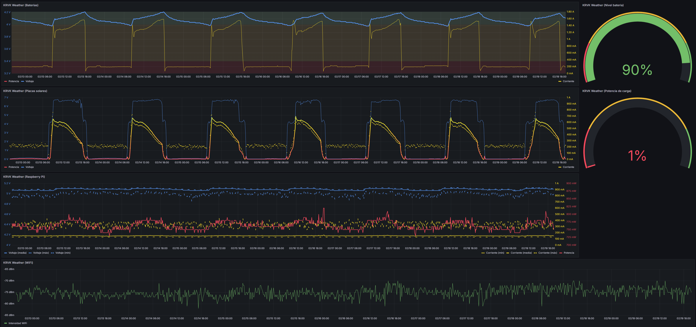
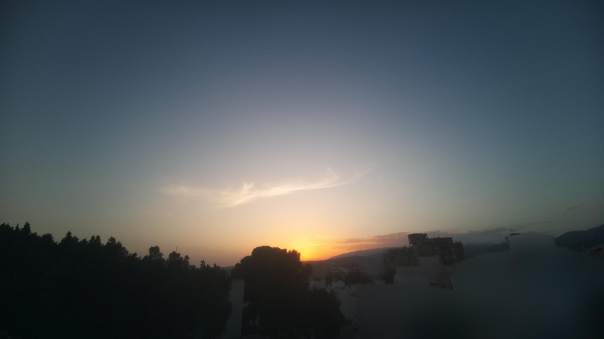

# KRVKWeather Frame
Dispositivo de bajo consumo que monitoriza los valores obtenidos de [KRVKWeather](#qué-es-krvkweather).

## ¿Qué es KRVKWeather?
Estación meteorológica desarrollada e implementada desde cero. Una Raspberry Pi Zero 2W controla el sistema, sensores y cámara.
Las 2 principales funciones de KRVKWeather son las siguientes:

### Estación meteorológica

### Cámara para puesta de Sol
